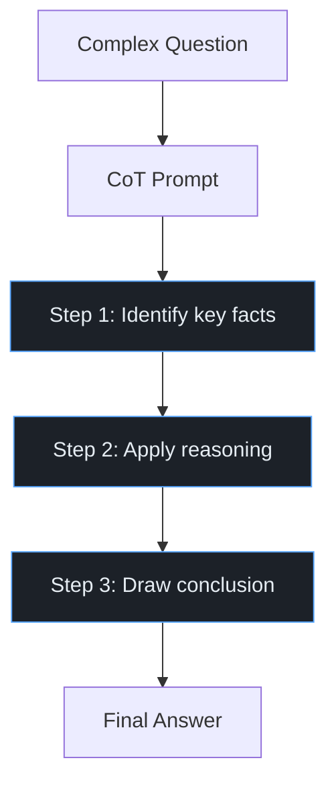

import Callout from '../../components/Callout.astro';
import Playground from '../../components/Playground.astro';

## Overview

Chain-of-Thought (CoT) prompting is a technique that dramatically improves LLM performance on reasoning tasks by asking the model to **show its work** — generating intermediate reasoning steps before arriving at a final answer.

Rather than asking for a direct answer, you either provide few-shot examples with step-by-step reasoning, or simply append "Let's think step by step" (zero-shot CoT).

## When to Use

- **Math & logic** problems requiring multi-step reasoning
- **Complex Q&A** where the answer depends on combining multiple facts
- **Code generation** requiring algorithm design
- **Decision-making** with multiple factors to weigh
- Any task where jumping to the answer causes errors

## Architecture

## How It Works

### Zero-Shot CoT
Simply append **"Let's think step by step."** to your prompt. Surprisingly effective!

### Few-Shot CoT
Provide examples of problems solved step-by-step, then pose the new problem.

### The Key Insight
The reasoning chain **keeps the model on track** as it "thinks through" the problem. Without CoT, the model must compress all reasoning into the token prediction — with CoT, each step informs the next.

## Implementation

<Playground code={`# Chain-of-Thought Prompting Patterns

# --- 1. Zero-Shot CoT ---
zero_shot_prompt = """
Q: A store has 45 apples. They sell 12 in the morning and receive 
a shipment of 30 in the afternoon. Then they sell 18 more in the 
evening. How many apples do they have at closing?

Let's think step by step.
"""

print("=== Zero-Shot CoT Prompt ===")
print(zero_shot_prompt)

# Expected LLM response:
expected_response = """
Step 1: Start with 45 apples.
Step 2: Sell 12 in morning → 45 - 12 = 33 apples
Step 3: Receive 30 shipment → 33 + 30 = 63 apples
Step 4: Sell 18 in evening → 63 - 18 = 45 apples
Answer: 45 apples
"""
print("Expected LLM Response:", expected_response)

# --- 2. Few-Shot CoT Template ---
def build_cot_prompt(examples: list[dict], question: str) -> str:
    """Build a few-shot CoT prompt from examples."""
    prompt_parts = []
    
    for ex in examples:
        prompt_parts.append(f"Q: {ex['question']}")
        prompt_parts.append(f"A: Let's think step by step.")
        for i, step in enumerate(ex['steps'], 1):
            prompt_parts.append(f"   Step {i}: {step}")
        prompt_parts.append(f"   Therefore, the answer is {ex['answer']}.")
        prompt_parts.append("")
    
    prompt_parts.append(f"Q: {question}")
    prompt_parts.append("A: Let's think step by step.")
    
    return "\\n".join(prompt_parts)

# Example: math word problems
examples = [
    {
        "question": "Roger has 5 tennis balls. He buys 2 cans of 3 balls each. How many does he have?",
        "steps": [
            "Roger starts with 5 balls.",
            "Each can has 3 balls, and he buys 2 cans → 2 × 3 = 6 balls.",
            "Total = 5 + 6 = 11 balls."
        ],
        "answer": "11"
    },
    {
        "question": "A cafe has 23 tables. 15 are occupied, then 8 groups leave and 4 new groups arrive.",
        "steps": [
            "Start: 15 occupied, 8 free (23 - 15 = 8).",
            "8 groups leave → 15 - 8 = 7 still occupied.",
            "4 new groups arrive → 7 + 4 = 11 occupied.",
            "Free tables: 23 - 11 = 12 free."
        ],
        "answer": "12 free tables"
    }
]

new_question = "A bookshelf has 3 shelves. Each shelf can hold 8 books. If 14 books are placed and 5 more arrive, how many empty spots remain?"

prompt = build_cot_prompt(examples, new_question)
print("\\n=== Few-Shot CoT Prompt ===")
print(prompt)

# --- 3. Structured CoT for classification ---
print("\\n=== Structured CoT for Classification ===")
classification_template = """
Classify the customer message as: billing, technical, general.

Message: "I was charged twice for my subscription this month"

Think step by step:
1. Identify key phrases: "charged twice", "subscription" 
2. These relate to payment/charges → billing issue
3. No technical or general inquiry aspects

Classification: billing
"""
print(classification_template)
`} />

## Gotchas & Best Practices

<Callout type="danger" title="CoT Can Hurt Simple Tasks">
  On simple factual lookups or straightforward tasks, CoT adds unnecessary tokens 
  and can actually *reduce* accuracy. Use it only for tasks that benefit from reasoning.
</Callout>

<Callout type="warning" title="Faithful vs. Unfaithful Reasoning">
  The model's chain-of-thought may not reflect its *actual* reasoning process. The steps 
  might look correct but be post-hoc rationalization. Don't treat CoT as proof of correctness.
</Callout>

<Callout type="tip" title="Combine with Self-Consistency">
  Generate multiple CoT paths and take a majority vote on the final answer. This 
  significantly improves accuracy on math and logic tasks (see Self-Consistency pattern).
</Callout>

<Callout type="tip" title="Be Specific About Steps">
  Instead of "think step by step," try "First identify the given information, then set up 
  the equation, then solve." More specific instructions yield more structured reasoning.
</Callout>

## Variations

- **Zero-Shot CoT** — "Let's think step by step"
- **Few-Shot CoT** — Provide worked examples
- **Self-Consistency** — Multiple CoT paths + majority vote
- **Tree-of-Thought** — Explore branching reasoning paths
- **Least-to-Most** — Decompose into subproblems, solve incrementally

## Further Reading

- [Chain-of-Thought paper (Wei et al., 2022)](https://arxiv.org/abs/2201.11903)
- [Zero-shot CoT (Kojima et al., 2022)](https://arxiv.org/abs/2205.11916)
- [Self-Consistency (Wang et al., 2022)](https://arxiv.org/abs/2203.11171)
