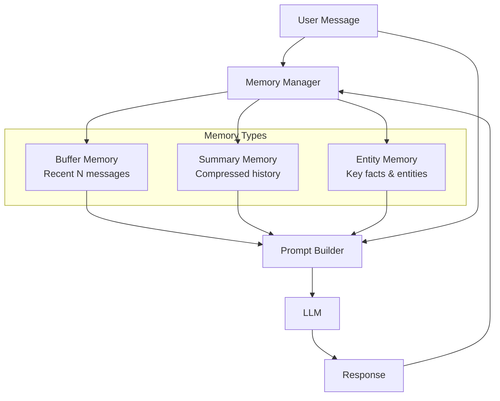

import Callout from '../../components/Callout.astro';
import Playground from '../../components/Playground.astro';

## Overview

LLMs are stateless — each API call is independent. **Conversational Memory** patterns maintain context across turns by managing what previous information to include in each request. The challenge: context windows are limited, so you must be strategic about what to remember.

## When to Use

- Building **chatbots** or **conversational assistants**
- Multi-turn workflows requiring context from earlier turns
- Long conversations that **exceed the context window**
- Applications where users expect the AI to **remember preferences** or facts

## Architecture

## Memory Strategies

| Strategy | How It Works | Pros | Cons |
|----------|-------------|------|------|
| **Buffer** | Keep last N messages | Simple, preserves recent context | Loses old context |
| **Window** | Sliding window of N tokens | Token-aware | Hard cuts mid-conversation |
| **Summary** | LLM summarizes older messages | Compact, retains key info | Lossy, extra LLM call |
| **Entity** | Extract and track entities/facts | Structured, selective | Complex to maintain |
| **Hybrid** | Combine summary + recent buffer | Best of both | More complexity |

## Implementation

<Playground code={`# Conversational Memory Patterns

from dataclasses import dataclass, field
from collections import deque

@dataclass
class Message:
    role: str  # "user" or "assistant"
    content: str

# === 1. Buffer Memory (Last N Messages) ===
class BufferMemory:
    """Keep the last N messages."""
    def __init__(self, max_messages: int = 10):
        self.messages: deque[Message] = deque(maxlen=max_messages)
    
    def add(self, msg: Message):
        self.messages.append(msg)
    
    def get_context(self) -> list[Message]:
        return list(self.messages)
    
    def __repr__(self):
        return f"BufferMemory({len(self.messages)} messages)"

# === 2. Summary Memory ===
class SummaryMemory:
    """Maintain a running summary of the conversation."""
    def __init__(self, max_recent: int = 4):
        self.summary: str = ""
        self.recent: deque[Message] = deque(maxlen=max_recent)
        self.all_messages: list[Message] = []
    
    def add(self, msg: Message):
        self.all_messages.append(msg)
        self.recent.append(msg)
        
        # When recent buffer is full, summarize older messages
        if len(self.all_messages) > self.recent.maxlen and len(self.all_messages) % self.recent.maxlen == 0:
            self._update_summary()
    
    def _update_summary(self):
        """In production, this would call an LLM to summarize."""
        old = self.all_messages[:-self.recent.maxlen]
        topics = set()
        for msg in old:
            # Simple keyword extraction (LLM would do this in production)
            for word in msg.content.split():
                if len(word) > 5:
                    topics.add(word.lower().strip('.,!?'))
        self.summary = f"Previous discussion covered: {', '.join(list(topics)[:10])}"
    
    def get_context(self) -> str:
        parts = []
        if self.summary:
            parts.append(f"[Summary of earlier conversation]: {self.summary}")
        parts.append("[Recent messages]:")
        for msg in self.recent:
            parts.append(f"  {msg.role}: {msg.content}")
        return "\\n".join(parts)

# === 3. Entity Memory ===
class EntityMemory:
    """Track key entities and facts mentioned in conversation."""
    def __init__(self):
        self.entities: dict[str, list[str]] = {}
    
    def extract_and_store(self, msg: Message):
        """Simple entity extraction (LLM-based in production)."""
        content = msg.content
        # Demo: extract capitalized words as entities
        words = content.split()
        for i, word in enumerate(words):
            clean = word.strip('.,!?"\\'')
            if clean and clean[0].isupper() and len(clean) > 1:
                if clean not in ('The', 'This', 'That', 'What', 'How', 'When', 'Where', 'I', 'My', 'We'):
                    fact = ' '.join(words[max(0,i-2):min(len(words),i+3)])
                    if clean not in self.entities:
                        self.entities[clean] = []
                    self.entities[clean].append(fact.strip('.,!?'))
    
    def get_context(self) -> str:
        if not self.entities:
            return ""
        lines = ["[Known entities]:"]
        for entity, facts in self.entities.items():
            lines.append(f"  {entity}: {'; '.join(facts[-2:])}")  # Last 2 facts
        return "\\n".join(lines)

# === Demo ===
print("=== Buffer Memory Demo ===")
buffer = BufferMemory(max_messages=3)
conversation = [
    Message("user", "Hi! My name is Alice and I work at TechCorp."),
    Message("assistant", "Hello Alice! Nice to meet you. What can I help you with?"),
    Message("user", "I need help with our Python microservices architecture."),
    Message("assistant", "I'd be happy to help with your microservices. What specific challenges?"),
    Message("user", "We're having issues with service discovery and load balancing."),
]

for msg in conversation:
    buffer.add(msg)

print(f"Buffer keeps last 3 of {len(conversation)} messages:")
for msg in buffer.get_context():
    print(f"  {msg.role}: {msg.content[:60]}...")
    
print("\\n=== Summary Memory Demo ===")
summary_mem = SummaryMemory(max_recent=2)
for msg in conversation:
    summary_mem.add(msg)

print(summary_mem.get_context())

print("\\n=== Entity Memory Demo ===")
entity_mem = EntityMemory()
for msg in conversation:
    entity_mem.extract_and_store(msg)

print(entity_mem.get_context())
`} />

## Gotchas & Best Practices

<Callout type="danger" title="Token Limits Are Hard">
  Always count tokens, not messages. A single message can be thousands of tokens. 
  Use a tokenizer to measure actual context usage and leave room for the response.
</Callout>

<Callout type="warning" title="Summary Drift">
  Repeated summarization is lossy — important details can gradually disappear. 
  Consider keeping critical facts in a separate entity store that never gets summarized away.
</Callout>

<Callout type="tip" title="Hybrid Is Usually Best">
  In production, combine approaches: summary for old history + buffer for recent messages + 
  entity memory for key facts. This gives the best coverage within token limits.
</Callout>

<Callout type="tip" title="Let Users Correct Memory">
  Give users a way to see and correct what the AI remembers. This builds trust and 
  fixes inevitable extraction errors.
</Callout>

## Variations

- **Buffer Memory** — Simple FIFO message queue
- **Summary Memory** — LLM-generated summaries of older context
- **Entity Memory** — Track specific entities and facts
- **Knowledge Graph Memory** — Store relationships between entities
- **Retrieval-Based Memory** — Embed past messages, retrieve relevant ones per query

## Further Reading

- [LangChain Memory Types](https://python.langchain.com/docs/modules/memory/)
- [MemGPT (Packer et al., 2023)](https://arxiv.org/abs/2310.08560)
- [Generative Agents (Park et al., 2023)](https://arxiv.org/abs/2304.03442)
