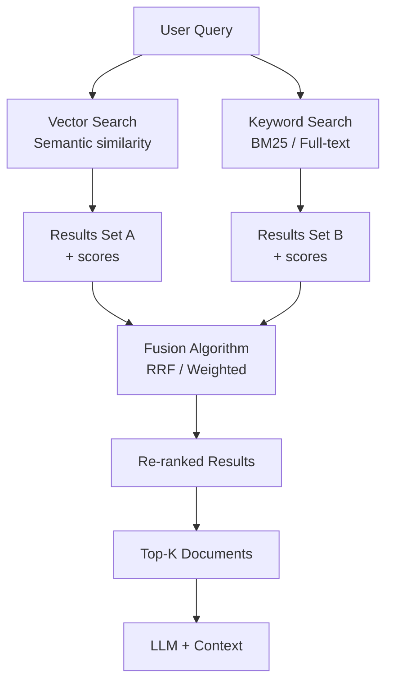

import Callout from '../../components/Callout.astro';
import Playground from '../../components/Playground.astro';

## Overview

Hybrid Search combines **semantic vector search** (find conceptually similar content) with **keyword-based search** like BM25 (find exact term matches). Neither alone is perfect — vector search misses exact terms and acronyms, while keyword search misses semantically similar phrases. Together they achieve significantly better retrieval quality for RAG.

## When to Use

- Your RAG pipeline has **retrieval quality issues** with vector search alone
- Documents contain **domain-specific jargon, acronyms, or codes** (e.g., "HIPAA", "K8s")
- Users query with **exact product names, error codes, or identifiers**
- You need robust retrieval across **different query styles** (natural language + exact match)

## Architecture

## Fusion Methods

| Method | Formula | Pros | Cons |
|--------|---------|------|------|
| **Reciprocal Rank Fusion (RRF)** | `1 / (k + rank)` for each result | No score normalization needed, robust | Fixed k parameter |
| **Weighted Linear** | `α * vector_score + (1-α) * keyword_score` | Tunable balance | Requires score normalization |
| **Relative Score Fusion** | Normalize scores to [0,1] then combine | Fair comparison | More complex |

## Implementation

<Playground code={`# Hybrid Search for RAG Implementation
import math
from collections import defaultdict
from dataclasses import dataclass

@dataclass
class Document:
    id: str
    content: str
    source: str

# === Sample Knowledge Base ===
documents = [
    Document("doc1", "Kubernetes (K8s) is a container orchestration platform for automating deployment and scaling of containerized applications.", "k8s-intro.md"),
    Document("doc2", "Docker containers package applications with their dependencies into standardized units for software development.", "docker-basics.md"),
    Document("doc3", "HIPAA compliance requires healthcare organizations to protect patient health information and ensure data privacy.", "hipaa-guide.md"),
    Document("doc4", "Container orchestration tools like Kubernetes manage the lifecycle of containers across multiple hosts.", "orchestration.md"),
    Document("doc5", "Pod is the smallest deployable unit in Kubernetes, containing one or more containers.", "k8s-pods.md"),
    Document("doc6", "Health Insurance Portability and Accountability Act sets standards for protecting sensitive patient data.", "hipaa-details.md"),
    Document("doc7", "Microservices architecture breaks applications into small independent services that communicate via APIs.", "microservices.md"),
    Document("doc8", "The kubectl command-line tool lets you control Kubernetes clusters and manage resources.", "kubectl-ref.md"),
]

# === 1. Simple Vector Search (TF-IDF-like) ===
def build_vocab(docs: list[Document]) -> list[str]:
    words = set()
    for doc in docs:
        words.update(doc.content.lower().split())
    return sorted(words)

VOCAB = build_vocab(documents)

def embed(text: str) -> list[float]:
    words = text.lower().split()
    return [words.count(w) / max(len(words), 1) for w in VOCAB]

def cosine_sim(a: list[float], b: list[float]) -> float:
    dot = sum(x*y for x, y in zip(a, b))
    ma = math.sqrt(sum(x*x for x in a))
    mb = math.sqrt(sum(x*x for x in b))
    return dot / (ma * mb) if ma and mb else 0.0

def vector_search(query: str, docs: list[Document], top_k: int = 5) -> list[tuple[Document, float]]:
    q_emb = embed(query)
    scored = [(doc, cosine_sim(q_emb, embed(doc.content))) for doc in docs]
    scored.sort(key=lambda x: x[1], reverse=True)
    return scored[:top_k]

# === 2. BM25 Keyword Search ===
def bm25_search(query: str, docs: list[Document], top_k: int = 5, k1: float = 1.5, b: float = 0.75) -> list[tuple[Document, float]]:
    query_terms = query.lower().split()
    avg_dl = sum(len(d.content.split()) for d in docs) / len(docs)
    N = len(docs)
    
    # Document frequency
    df = defaultdict(int)
    for doc in docs:
        doc_words = set(doc.content.lower().split())
        for term in query_terms:
            if term in doc_words:
                df[term] += 1
    
    scores = []
    for doc in docs:
        doc_words = doc.content.lower().split()
        dl = len(doc_words)
        score = 0.0
        
        for term in query_terms:
            tf = doc_words.count(term)
            if tf > 0 and df[term] > 0:
                idf = math.log((N - df[term] + 0.5) / (df[term] + 0.5) + 1)
                tf_norm = (tf * (k1 + 1)) / (tf + k1 * (1 - b + b * dl / avg_dl))
                score += idf * tf_norm
        
        scores.append((doc, score))
    
    scores.sort(key=lambda x: x[1], reverse=True)
    return scores[:top_k]

# === 3. Reciprocal Rank Fusion ===
def reciprocal_rank_fusion(
    result_lists: list[list[tuple[Document, float]]],
    k: int = 60
) -> list[tuple[Document, float]]:
    """Fuse multiple ranked lists using RRF."""
    rrf_scores: dict[str, float] = defaultdict(float)
    doc_map: dict[str, Document] = {}
    
    for results in result_lists:
        for rank, (doc, _score) in enumerate(results):
            rrf_scores[doc.id] += 1.0 / (k + rank + 1)
            doc_map[doc.id] = doc
    
    fused = [(doc_map[doc_id], score) for doc_id, score in rrf_scores.items()]
    fused.sort(key=lambda x: x[1], reverse=True)
    return fused

# === 4. Demo: Compare All Three Approaches ===
queries = [
    "K8s pod deployment",           # Acronym + specific terms
    "container management platform", # Semantic/conceptual
    "HIPAA patient data protection", # Acronym + concept mix
]

for query in queries:
    print(f"\\n{'='*55}")
    print(f"Query: \\"{query}\\"")
    print(f"{'='*55}")
    
    vec_results = vector_search(query, documents, top_k=4)
    bm25_results = bm25_search(query, documents, top_k=4)
    hybrid_results = reciprocal_rank_fusion([vec_results, bm25_results])
    
    print(f"\\n  Vector Search Top 3:")
    for doc, score in vec_results[:3]:
        print(f"    [{score:.3f}] {doc.id}: {doc.content[:55]}...")
    
    print(f"\\n  BM25 Search Top 3:")
    for doc, score in bm25_results[:3]:
        print(f"    [{score:.3f}] {doc.id}: {doc.content[:55]}...")
    
    print(f"\\n  Hybrid (RRF) Top 3:")
    for doc, score in hybrid_results[:3]:
        print(f"    [{score:.4f}] {doc.id}: {doc.content[:55]}...")
`} />

## Gotchas & Best Practices

<Callout type="danger" title="Score Scales Differ Wildly">
  Vector similarity scores (0-1) and BM25 scores (0-∞) cannot be directly combined. 
  Use RRF (rank-based, score-agnostic) or normalize both to [0, 1] before weighting.
</Callout>

<Callout type="warning" title="Tune the Alpha Weight">
  The optimal balance between vector and keyword search depends on your data and queries. 
  Start with α=0.5, then tune based on retrieval evaluation metrics.
</Callout>

<Callout type="tip" title="RRF Is a Strong Default">
  Reciprocal Rank Fusion works remarkably well without any tuning. It's the recommended 
  starting point — you can switch to weighted scoring later if needed.
</Callout>

<Callout type="tip" title="Use Native Hybrid When Available">
  Many vector databases (Weaviate, Qdrant, Pinecone) support hybrid search natively. 
  Use their built-in implementation rather than building your own — it's faster and better optimized.
</Callout>

## Variations

- **RRF Fusion** — Rank-based fusion, no tuning needed
- **Weighted Linear** — Manually tuned α between vector and keyword
- **Learned Fusion** — Train a model to optimally combine scores
- **Dense + Sparse + Reranker** — Three-stage pipeline for maximum quality

## Further Reading

- [Reciprocal Rank Fusion (Cormack et al., 2009)](https://plg.uwaterloo.ca/~gvcormac/cormacksigir09-rrf.pdf)
- [Weaviate Hybrid Search](https://weaviate.io/developers/weaviate/search/hybrid)
- [Pinecone Hybrid Search](https://docs.pinecone.io/guides/data/understanding-hybrid-search)
