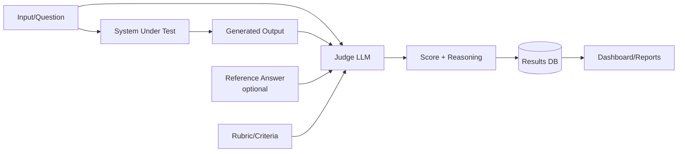

import Callout from '../../components/Callout.astro';
import Playground from '../../components/Playground.astro';

## Overview

LLM-as-Judge uses a (typically stronger) language model to evaluate the outputs of AI systems. Instead of relying solely on human evaluation (expensive, slow) or simple metrics (BLEU, ROUGE — often unreliable), you use an LLM with a well-designed rubric to grade responses on dimensions like correctness, helpfulness, safety, and style.

## When to Use

- **Scaling evaluation** beyond what human reviewers can handle
- Evaluating **open-ended outputs** where exact-match metrics fail
- Building **CI/CD pipelines** for LLM applications
- **A/B testing** different prompts, models, or RAG configurations
- Quick iteration on prompt engineering with automated feedback

## Architecture

## Judging Approaches

| Approach | Description | Best For |
|----------|-------------|----------|
| **Pointwise** | Score a single output on a scale | General quality assessment |
| **Pairwise** | Compare two outputs, pick the better one | A/B testing models/prompts |
| **Reference-based** | Compare output to a gold standard | Factual accuracy |
| **Multi-criteria** | Score on multiple dimensions separately | Comprehensive evaluation |

## Implementation

<Playground code={`# LLM-as-Judge Evaluation Pattern
import json

# --- 1. Define Evaluation Criteria ---
EVALUATION_RUBRIC = {
    "correctness": {
        "description": "Is the answer factually correct?",
        "scale": "1-5 (1=completely wrong, 5=fully correct)"
    },
    "helpfulness": {
        "description": "How helpful and complete is the answer?",
        "scale": "1-5 (1=not helpful, 5=comprehensive and actionable)"
    },
    "clarity": {
        "description": "Is the answer clear and well-structured?",
        "scale": "1-5 (1=confusing, 5=crystal clear)"
    }
}

# --- 2. Build Judge Prompt ---
def build_judge_prompt(question: str, answer: str, reference: str = None) -> str:
    """Build a prompt for the judge LLM."""
    rubric_text = ""
    for criterion, details in EVALUATION_RUBRIC.items():
        rubric_text += f"- {criterion}: {details['description']} ({details['scale']})\\n"
    
    prompt = f"""You are an expert evaluator. Score the following AI-generated answer.

## Question
{question}

## Answer to Evaluate
{answer}
"""
    
    if reference:
        prompt += f"""
## Reference Answer
{reference}
"""
    
    prompt += f"""
## Scoring Rubric
{rubric_text}

## Instructions
For each criterion, provide:
1. A score (1-5)
2. A brief justification

Format your response as:
- correctness: [score] - [justification]
- helpfulness: [score] - [justification]  
- clarity: [score] - [justification]
- overall: [average score]
"""
    return prompt

# --- 3. Parse Judge Scores (simplified) ---
def parse_scores(judge_response: str) -> dict:
    """Parse scores from judge response."""
    scores = {}
    for line in judge_response.strip().split("\\n"):
        line = line.strip("- ")
        for criterion in list(EVALUATION_RUBRIC.keys()) + ["overall"]:
            if line.lower().startswith(criterion):
                parts = line.split(":", 1)[1].strip()
                try:
                    score = int(parts[0])
                    justification = parts[2:].strip("- ").strip()
                    scores[criterion] = {
                        "score": score,
                        "justification": justification
                    }
                except (ValueError, IndexError):
                    pass
    return scores

# --- 4. Demo: Evaluate Sample Answers ---
test_cases = [
    {
        "question": "What is the capital of France?",
        "answer": "The capital of France is Paris. It's located in northern France along the Seine River and has been the capital since the 10th century.",
        "reference": "Paris",
        # Simulated judge response
        "judge_response": """- correctness: 5 - Completely accurate, Paris is indeed the capital
- helpfulness: 5 - Provides useful additional context about location and history
- clarity: 5 - Well-structured and easy to understand
- overall: 5.0"""
    },
    {
        "question": "Explain how neural networks learn",
        "answer": "Neural networks learn through magic and guessing.",
        "reference": "Neural networks learn through backpropagation, adjusting weights to minimize a loss function over training data.",
        "judge_response": """- correctness: 1 - Completely wrong, neural networks use backpropagation not magic
- helpfulness: 1 - Provides no useful information about the learning process  
- clarity: 3 - The sentence is clear but the content is wrong
- overall: 1.7"""
    },
    {
        "question": "What are the benefits of RAG?",
        "answer": "RAG (Retrieval-Augmented Generation) reduces hallucinations by grounding LLM responses in retrieved documents. It enables access to up-to-date information, supports source attribution, and doesn't require fine-tuning.",
        "reference": None,
        "judge_response": """- correctness: 5 - All stated benefits are accurate and well-known
- helpfulness: 4 - Good coverage of main benefits, could mention cost efficiency
- clarity: 5 - Well-organized with clear enumeration of benefits
- overall: 4.7"""
    }
]

print("=" * 60)
print("LLM-as-Judge Evaluation Results")
print("=" * 60)

all_scores = []

for i, tc in enumerate(test_cases):
    print(f"\\n--- Test Case {i+1} ---")
    print(f"Q: {tc['question']}")
    print(f"A: {tc['answer'][:80]}...")
    
    # In production: send build_judge_prompt() to an LLM
    prompt = build_judge_prompt(tc["question"], tc["answer"], tc["reference"])
    
    # Parse the (simulated) judge response
    scores = parse_scores(tc["judge_response"])
    all_scores.append(scores)
    
    for criterion, data in scores.items():
        print(f"  {criterion}: {data['score']}/5 - {data['justification']}")

# Aggregate results
print("\\n" + "=" * 60)
print("Aggregate Results")
print("=" * 60)
for criterion in list(EVALUATION_RUBRIC.keys()) + ["overall"]:
    criterion_scores = [s[criterion]["score"] for s in all_scores if criterion in s]
    if criterion_scores:
        avg = sum(criterion_scores) / len(criterion_scores)
        print(f"  {criterion}: {avg:.1f}/5 avg")
`} />

## Gotchas & Best Practices

<Callout type="danger" title="Judge Bias">
  LLM judges have systematic biases: they prefer longer answers, verbose responses, and 
  their own style. Calibrate with human evaluations and use position-debiasing for pairwise comparisons.
</Callout>

<Callout type="danger" title="Self-Evaluation Blindspot">
  Using the same model to judge its own outputs is unreliable — it tends to rate itself highly. 
  Use a different (ideally stronger) model as the judge.
</Callout>

<Callout type="warning" title="Rubric Specificity">
  Vague criteria like "Is this good?" produce inconsistent scores. Define concrete rubrics 
  with specific scoring anchors for each level (1-5).
</Callout>

<Callout type="tip" title="Use CoT for Better Judging">
  Ask the judge to explain its reasoning before giving a score. This "judge chain-of-thought" 
  produces more accurate and consistent evaluations.
</Callout>

<Callout type="tip" title="Calibrate with Human Labels">
  Build a set of human-labeled examples and measure judge agreement (Cohen's kappa). 
  Use these as few-shot examples to align the judge with human preferences.
</Callout>

## Variations

- **Pointwise Grading** — Score single outputs against criteria
- **Pairwise Comparison** — Pick the winner between two outputs
- **Multi-Dimension** — Score across multiple independent criteria
- **Cascade** — Fast/cheap judge first, expensive judge for edge cases
- **Constitutional AI** — Self-judge against a set of principles

## Further Reading

- [Judging LLM-as-Judge (Zheng et al., 2023)](https://arxiv.org/abs/2306.05685)
- [MT-Bench and Chatbot Arena](https://huggingface.co/spaces/lmsys/chatbot-arena-leaderboard)
- [RAGAS - RAG evaluation framework](https://docs.ragas.io/)
