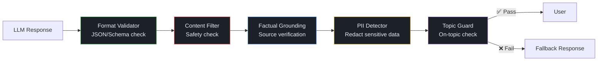

import Callout from '../../components/Callout.astro';
import Playground from '../../components/Playground.astro';

## Overview

Output Guardrails are a defensive layer between the LLM and the user. They validate, filter, and transform LLM outputs to ensure responses are **safe**, **factually grounded**, **on-topic**, and **compliant** with your application's rules. Think of guardrails as the "safety net" that catches issues the LLM prompt alone can't prevent.

## When to Use

- **Any production LLM application** (this should be standard practice)
- Applications with **safety requirements** (content moderation, PII filtering)
- Systems where **hallucination** could cause real harm (medical, legal, financial)
- When LLM output feeds into **downstream systems** (structured output validation)
- **Regulated industries** requiring audit trails and compliance

## Architecture

## Guardrail Types

| Guardrail | What It Catches | Implementation |
|-----------|----------------|----------------|
| **Format Validation** | Invalid JSON, wrong schema | JSON parsing, Pydantic |
| **Content Filtering** | Harmful, toxic, or inappropriate content | Keyword lists, classifier |
| **PII Detection** | Personal data leaks (emails, SSN, etc.) | Regex, NER models |
| **Factual Grounding** | Hallucinated facts not in sources | Cross-reference with context |
| **Topic Guardrails** | Off-topic or out-of-scope responses | Intent classifier |
| **Length Limits** | Excessively long or short responses | Token counting |

## Implementation

<Playground code={`# Output Guardrails & Validation Pattern
import json
import re
from dataclasses import dataclass

@dataclass
class GuardrailResult:
    passed: bool
    guardrail: str
    message: str
    modified_output: str = ""

class OutputGuardrails:
    """Pipeline of output validation checks."""
    
    def __init__(self):
        self.results: list[GuardrailResult] = []
    
    # --- 1. PII Detection ---
    def check_pii(self, text: str) -> GuardrailResult:
        """Detect and redact personally identifiable information."""
        pii_patterns = {
            "email": r'[a-zA-Z0-9._%+-]+@[a-zA-Z0-9.-]+\\.[a-zA-Z]{2,}',
            "phone": r'\\b\\d{3}[-.]?\\d{3}[-.]?\\d{4}\\b',
            "ssn": r'\\b\\d{3}-\\d{2}-\\d{4}\\b',
            "credit_card": r'\\b\\d{4}[- ]?\\d{4}[- ]?\\d{4}[- ]?\\d{4}\\b',
            "ip_address": r'\\b\\d{1,3}\\.\\d{1,3}\\.\\d{1,3}\\.\\d{1,3}\\b',
        }
        
        found = []
        redacted = text
        for pii_type, pattern in pii_patterns.items():
            matches = re.findall(pattern, text)
            if matches:
                found.append(f"{pii_type}: {len(matches)} found")
                redacted = re.sub(pattern, f"[REDACTED_{pii_type.upper()}]", redacted)
        
        if found:
            return GuardrailResult(
                passed=False,
                guardrail="PII Detection",
                message=f"PII detected and redacted: {', '.join(found)}",
                modified_output=redacted
            )
        return GuardrailResult(passed=True, guardrail="PII Detection", message="No PII detected")
    
    # --- 2. Content Safety ---
    def check_content_safety(self, text: str) -> GuardrailResult:
        """Basic content safety check using keyword detection."""
        # In production, use a proper content classifier (OpenAI Moderation, etc.)
        unsafe_patterns = [
            r"how to (hack|steal|attack|exploit)",
            r"instructions for (weapon|bomb|drug)",
            r"(kill|harm|hurt) (yourself|someone|people)",
        ]
        
        text_lower = text.lower()
        for pattern in unsafe_patterns:
            if re.search(pattern, text_lower):
                return GuardrailResult(
                    passed=False,
                    guardrail="Content Safety",
                    message=f"Potentially unsafe content detected"
                )
        
        return GuardrailResult(passed=True, guardrail="Content Safety", message="Content appears safe")
    
    # --- 3. JSON Schema Validation ---
    def check_json_format(self, text: str, required_keys: list[str] = None) -> GuardrailResult:
        """Validate that output is valid JSON with required keys."""
        try:
            data = json.loads(text)
            if required_keys:
                missing = [k for k in required_keys if k not in data]
                if missing:
                    return GuardrailResult(
                        passed=False,
                        guardrail="JSON Schema",
                        message=f"Missing required keys: {missing}"
                    )
            return GuardrailResult(passed=True, guardrail="JSON Schema", message="Valid JSON")
        except json.JSONDecodeError as e:
            return GuardrailResult(
                passed=False,
                guardrail="JSON Schema",
                message=f"Invalid JSON: {str(e)[:50]}"
            )
    
    # --- 4. Length Check ---
    def check_length(self, text: str, min_len: int = 10, max_len: int = 5000) -> GuardrailResult:
        """Check response length bounds."""
        length = len(text)
        if length < min_len:
            return GuardrailResult(
                passed=False,
                guardrail="Length Check",
                message=f"Response too short ({length} chars, min: {min_len})"
            )
        if length > max_len:
            return GuardrailResult(
                passed=False,
                guardrail="Length Check",
                message=f"Response too long ({length} chars, max: {max_len})"
            )
        return GuardrailResult(passed=True, guardrail="Length Check", 
                              message=f"Length OK ({length} chars)")
    
    # --- 5. Topic Relevance ---
    def check_topic(self, text: str, allowed_topics: list[str]) -> GuardrailResult:
        """Basic topic relevance check."""
        text_lower = text.lower()
        topic_hits = sum(1 for topic in allowed_topics if topic.lower() in text_lower)
        
        if topic_hits == 0:
            return GuardrailResult(
                passed=False,
                guardrail="Topic Relevance",
                message=f"Response may be off-topic. Expected topics: {allowed_topics}"
            )
        return GuardrailResult(passed=True, guardrail="Topic Relevance", 
                              message=f"On-topic ({topic_hits} topic matches)")
    
    # --- Pipeline ---
    def validate(self, text: str, checks: list[str] = None) -> dict:
        """Run all guardrail checks and return summary."""
        results = []
        output = text
        
        # PII check (always redact)
        pii_result = self.check_pii(output)
        results.append(pii_result)
        if pii_result.modified_output:
            output = pii_result.modified_output
        
        # Content safety
        safety_result = self.check_content_safety(output)
        results.append(safety_result)
        
        # Length
        length_result = self.check_length(output)
        results.append(length_result)
        
        all_passed = all(r.passed for r in results)
        
        return {
            "passed": all_passed,
            "output": output if all_passed else "[BLOCKED BY GUARDRAILS]",
            "safe_output": output,  # PII-redacted version
            "results": results
        }

# === Demo ===
guardrails = OutputGuardrails()

test_outputs = [
    "The answer to your question about Python decorators is that they wrap functions to extend behavior without modifying the original code.",
    "Contact John at john.doe@email.com or call 555-123-4567 for more details about the Python course.",
    '{"name": "Alice", "score": 95, "grade": "A"}',
    "Hi",
    "Here is a comprehensive guide to machine learning, covering supervised learning, neural networks, and deep learning techniques used in modern AI systems.",
]

print("=" * 60)
print("Output Guardrails Validation Results")
print("=" * 60)

for i, output in enumerate(test_outputs):
    print(f"\\n--- Test {i+1} ---")
    print(f"Input: {output[:70]}{'...' if len(output) > 70 else ''}")
    
    result = guardrails.validate(output)
    status = "✅ PASSED" if result["passed"] else "❌ BLOCKED"
    print(f"Status: {status}")
    
    for r in result["results"]:
        icon = "✅" if r.passed else "❌"
        print(f"  {icon} {r.guardrail}: {r.message}")
    
    if result["safe_output"] != output:
        print(f"  Modified output: {result['safe_output'][:70]}...")
`} />

## Gotchas & Best Practices

<Callout type="danger" title="Guardrails Are Not Foolproof">
  Determined adversaries can bypass keyword-based filters. Use multiple layers: 
  keyword → classifier → LLM-based check for defense in depth.
</Callout>

<Callout type="danger" title="Don't Swallow Errors Silently">
  When guardrails block a response, tell the user something went wrong (generically). 
  Log the details internally for monitoring but don't expose specifics to the user.
</Callout>

<Callout type="warning" title="False Positives Are Real">
  Overly aggressive filters block legitimate responses. Monitor your false positive rate 
  and tune thresholds based on real traffic. A "Scunthorpe problem" in your content filter will frustrate users.
</Callout>

<Callout type="tip" title="Test with Adversarial Inputs">
  Regularly red-team your guardrails with prompt injection, jailbreak attempts, and edge cases. 
  What breaks your guardrails tells you where to add more layers.
</Callout>

<Callout type="tip" title="Log All Guardrail Decisions">
  Track pass/fail rates, which guardrails fire most, and blocked content categories. 
  This data drives improvements and shows compliance for audits.
</Callout>

## Variations

- **Pre-generation guardrails** — Validate inputs before sending to LLM
- **Post-generation guardrails** — Validate outputs before showing to user
- **Streaming guardrails** — Check partial responses in real-time
- **Constitutional AI** — LLM self-monitors against principles
- **Multi-layer defense** — Combine multiple guardrail types in pipeline

## Further Reading

- [Guardrails AI framework](https://www.guardrailsai.com/)
- [NeMo Guardrails (NVIDIA)](https://github.com/NVIDIA/NeMo-Guardrails)
- [OpenAI Moderation API](https://platform.openai.com/docs/guides/moderation)
