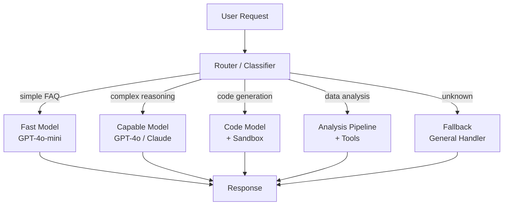

import Callout from '../../components/Callout.astro';
import Playground from '../../components/Playground.astro';

## Overview

Prompt Routing directs user requests to the most appropriate handler — a specialized prompt, a specific model, or an entire pipeline — based on the request's type, complexity, or domain. Instead of one monolithic prompt trying to handle everything, you build a **router** that classifies intent and dispatches intelligently.

## When to Use

- Your system handles **diverse request types** (FAQ, coding, analysis, creative writing)
- Different tasks benefit from **different models** (fast vs. capable)
- You want to **optimize cost** by routing simple queries to cheaper models
- Complex workflows require **different processing pipelines**

## Architecture

## Routing Strategies

| Strategy | How It Works | Pros | Cons |
|----------|-------------|------|------|
| **LLM Classifier** | LLM classifies intent → route | Flexible, handles nuance | Extra LLM call cost |
| **Keyword/Regex** | Pattern matching on input | Fast, no LLM cost | Brittle, limited |
| **Embedding Similarity** | Compare to route exemplars | Good accuracy, no LLM | Requires examples |
| **Cascade** | Try cheap model first, escalate | Cost-optimized | Higher latency on escalation |

## Implementation

<Playground code={`# Prompt Routing & Orchestration Pattern
import math

# --- 1. Define Routes ---
ROUTES = {
    "greeting": {
        "description": "Simple greetings and small talk",
        "handler": "fast_model",
        "keywords": ["hello", "hi", "hey", "thanks", "bye", "good morning"],
        "system_prompt": "You are a friendly assistant. Keep responses brief and warm."
    },
    "coding": {
        "description": "Programming and code-related questions",
        "handler": "code_model",
        "keywords": ["code", "python", "javascript", "function", "bug", "error", "program", "api"],
        "system_prompt": "You are an expert programmer. Provide clean, well-commented code."
    },
    "analysis": {
        "description": "Data analysis and math questions",
        "handler": "capable_model",
        "keywords": ["analyze", "calculate", "statistics", "data", "compare", "trend", "average"],
        "system_prompt": "You are a data analyst. Show your work and explain your reasoning."
    },
    "creative": {
        "description": "Creative writing and brainstorming",
        "handler": "capable_model",
        "keywords": ["write", "story", "poem", "creative", "brainstorm", "ideas", "imagine"],
        "system_prompt": "You are a creative writer. Be imaginative and engaging."
    },
    "factual": {
        "description": "Factual questions and knowledge lookup",
        "handler": "fast_model",
        "keywords": ["what is", "who is", "when did", "where is", "how many", "define", "explain"],
        "system_prompt": "You are a knowledgeable assistant. Be accurate and concise."
    }
}

# --- 2. Keyword-Based Router ---
def keyword_route(query: str) -> tuple[str, float]:
    """Route based on keyword matching. Returns (route_name, confidence)."""
    query_lower = query.lower()
    scores = {}
    
    for route_name, config in ROUTES.items():
        matches = sum(1 for kw in config["keywords"] if kw in query_lower)
        scores[route_name] = matches
    
    if max(scores.values()) == 0:
        return "fallback", 0.0
    
    best = max(scores, key=scores.get)
    total = sum(scores.values())
    confidence = scores[best] / total if total > 0 else 0
    return best, confidence

# --- 3. Embedding-Based Router (simplified) ---
def simple_embed(text: str) -> list[float]:
    """Toy embedding for demo (word frequency vector)."""
    common_words = ["code", "data", "write", "hello", "what", "how", "function",
                    "analyze", "story", "python", "calculate", "creative", "explain"]
    words = text.lower().split()
    return [words.count(w) / max(len(words), 1) for w in common_words]

def cosine_sim(a: list[float], b: list[float]) -> float:
    dot = sum(x * y for x, y in zip(a, b))
    mag_a = math.sqrt(sum(x**2 for x in a))
    mag_b = math.sqrt(sum(x**2 for x in b))
    return dot / (mag_a * mag_b) if mag_a and mag_b else 0.0

def embedding_route(query: str) -> tuple[str, float]:
    """Route based on embedding similarity to route descriptions."""
    query_emb = simple_embed(query)
    best_route = "fallback"
    best_score = 0.0
    
    for route_name, config in ROUTES.items():
        # Embed route description + keywords
        route_text = config["description"] + " " + " ".join(config["keywords"])
        route_emb = simple_embed(route_text)
        score = cosine_sim(query_emb, route_emb)
        if score > best_score:
            best_score = score
            best_route = route_name
    
    return best_route, best_score

# --- 4. Cascade Router ---
class CascadeRouter:
    """Try fast model first, escalate to capable model if confidence is low."""
    
    def __init__(self, confidence_threshold: float = 0.6):
        self.threshold = confidence_threshold
    
    def route(self, query: str) -> dict:
        route, confidence = keyword_route(query)
        
        if confidence >= self.threshold:
            return {
                "route": route,
                "model": "fast_model (gpt-4o-mini)",
                "confidence": confidence,
                "escalated": False
            }
        else:
            # Low confidence → use more capable model
            route, confidence = embedding_route(query)
            return {
                "route": route,
                "model": "capable_model (gpt-4o)",
                "confidence": confidence,
                "escalated": True
            }

# --- 5. Demo ---
test_queries = [
    "Hello! How are you today?",
    "Write a Python function to sort a list of dictionaries by key",
    "Analyze the trend in these sales numbers",
    "Write me a short poem about machine learning",
    "What is the capital of Japan?",
    "Help me debug this mysterious issue with my quantum flux capacitor",
]

print("=== Keyword Router ===")
for query in test_queries:
    route, conf = keyword_route(query)
    handler = ROUTES.get(route, {}).get("handler", "general")
    print(f"  [{route:>10}] (conf: {conf:.2f}, handler: {handler})")
    print(f"    Q: {query}")

print("\\n=== Cascade Router ===")
cascade = CascadeRouter(confidence_threshold=0.5)
for query in test_queries:
    result = cascade.route(query)
    esc = " ⬆ ESCALATED" if result["escalated"] else ""
    print(f"  [{result['route']:>10}] → {result['model']} (conf: {result['confidence']:.2f}){esc}")
    print(f"    Q: {query}")
`} />

## Gotchas & Best Practices

<Callout type="danger" title="Fallback Is Mandatory">
  Always have a fallback route for unclassified requests. Without it, edge cases 
  silently fail or get misrouted to inappropriate handlers.
</Callout>

<Callout type="warning" title="Routing Adds Latency">
  An LLM-based router adds a full inference step. For latency-sensitive apps, prefer 
  keyword/embedding routing and reserve LLM classification for ambiguous cases.
</Callout>

<Callout type="tip" title="Log Everything">
  Log route decisions, confidence scores, and outcomes. This data is essential for 
  improving routing accuracy and identifying miscategorized requests.
</Callout>

<Callout type="tip" title="A/B Test Route Assignments">
  Periodically test whether routing actually improves outcomes. Sometimes a single 
  powerful model outperforms a complex routing setup.
</Callout>

## Variations

- **Intent Classifier** — LLM or fine-tuned model classifies intent
- **Semantic Router** — Embedding similarity to route exemplars
- **Cascade** — Progressive escalation from cheap to expensive
- **Parallel Fan-out** — Send to multiple routes, pick best response
- **Dynamic Routing** — Adjust routes based on load, cost, or performance metrics

## Further Reading

- [Semantic Router library](https://github.com/aurelio-labs/semantic-router)
- [LangChain Routing](https://python.langchain.com/docs/how_to/routing/)
- [Martian Model Router](https://withmartian.com/)
