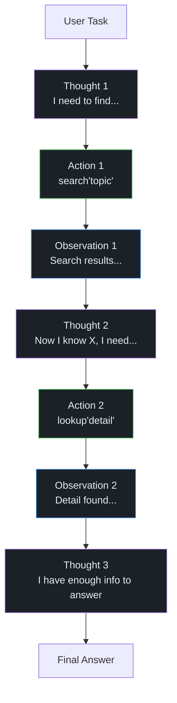

import Callout from '../../components/Callout.astro';
import Playground from '../../components/Playground.astro';

## Overview

ReAct (Reasoning + Acting) is a foundational agent pattern where the LLM operates in a **Thought → Action → Observation** loop. At each step, the model reasons about the current situation (Thought), decides what tool to invoke (Action), receives the result (Observation), and then reasons about the next step.

This interleaved approach lets LLMs solve complex multi-step tasks that require both reasoning and real-world interaction.

## When to Use

- Tasks requiring **multiple steps** with external data gathering
- Problems where the path to the answer **isn't known in advance**
- Scenarios needing both **reasoning and action** (research, debugging, data analysis)
- Building general-purpose **AI assistants** that can use multiple tools

## Architecture

## How It Works

The ReAct loop follows a strict pattern:

1. **Thought**: The LLM reasons about what it knows and what it needs to do next
2. **Action**: The LLM selects a tool and provides arguments
3. **Observation**: The tool executes and returns results
4. **Repeat** until the LLM decides it has enough information to give a final answer

## Implementation

<Playground code={`# ReAct Agent Pattern Implementation

class ReActAgent:
    """A simple ReAct agent that interleaves reasoning and acting."""
    
    def __init__(self, tools: dict, max_steps: int = 5):
        self.tools = tools
        self.max_steps = max_steps
        self.trace: list[dict] = []
    
    def execute_tool(self, tool_name: str, tool_input: str) -> str:
        """Execute a tool and return the observation."""
        if tool_name not in self.tools:
            return f"Error: Tool '{tool_name}' not found. Available: {list(self.tools.keys())}"
        try:
            return self.tools[tool_name](tool_input)
        except Exception as e:
            return f"Error executing {tool_name}: {str(e)}"
    
    def run(self, task: str, simulated_steps: list[dict]) -> str:
        """Run the agent loop with simulated LLM responses."""
        print(f"Task: {task}")
        print("=" * 60)
        
        for i, step in enumerate(simulated_steps):
            if i >= self.max_steps:
                print(f"\\n⚠ Max steps ({self.max_steps}) reached!")
                break
            
            # Thought
            thought = step.get("thought", "")
            print(f"\\nThought {i+1}: {thought}")
            
            # Check if final answer
            if "final_answer" in step:
                print(f"\\nFinal Answer: {step['final_answer']}")
                return step["final_answer"]
            
            # Action
            action = step.get("action", "")
            action_input = step.get("action_input", "")
            print(f"Action {i+1}: {action}({action_input})")
            
            # Observation (execute tool)
            observation = self.execute_tool(action, action_input)
            print(f"Observation {i+1}: {observation}")
            
            self.trace.append({
                "step": i + 1,
                "thought": thought,
                "action": action,
                "action_input": action_input,
                "observation": observation
            })
        
        return "Agent did not reach a final answer."

# --- Define Tools ---
knowledge_base = {
    "python": "Python is a high-level programming language created by Guido van Rossum in 1991. It emphasizes readability and supports multiple programming paradigms.",
    "rag": "RAG (Retrieval-Augmented Generation) was introduced by Lewis et al. in 2020. It combines retrieval from a knowledge base with LLM generation.",
    "transformer": "Transformers were introduced in 'Attention Is All You Need' (Vaswani et al., 2017). They use self-attention mechanisms.",
    "react": "ReAct was introduced by Yao et al. in 2022. It interleaves reasoning and acting for LLM agents.",
}

def search(query: str) -> str:
    """Search the knowledge base."""
    query_lower = query.lower()
    results = []
    for key, value in knowledge_base.items():
        if key in query_lower or any(w in value.lower() for w in query_lower.split()):
            results.append(f"[{key}]: {value}")
    return " | ".join(results) if results else "No results found."

def calculate(expression: str) -> str:
    """Evaluate a math expression."""
    return str(eval(expression))

def get_year(topic: str) -> str:
    """Get the year something was introduced."""
    years = {"python": "1991", "transformer": "2017", "rag": "2020", "react": "2022"}
    return years.get(topic.lower(), "Unknown")

# --- Run the Agent ---
agent = ReActAgent(
    tools={"search": search, "calculate": calculate, "get_year": get_year},
    max_steps=5
)

# Simulated LLM decisions (in production, the LLM generates these)
steps = [
    {
        "thought": "I need to find out when RAG and Transformers were introduced to calculate the time between them.",
        "action": "get_year",
        "action_input": "transformer"
    },
    {
        "thought": "Transformers were introduced in 2017. Now let me find when RAG was introduced.",
        "action": "get_year",
        "action_input": "rag"
    },
    {
        "thought": "RAG was 2020, Transformers was 2017. Let me calculate the difference.",
        "action": "calculate",
        "action_input": "2020 - 2017"
    },
    {
        "thought": "The difference is 3 years. Let me search for more context about both.",
        "action": "search",
        "action_input": "rag transformer"
    },
    {
        "thought": "I now have all the information I need to answer the question.",
        "final_answer": "RAG was introduced 3 years after Transformers. Transformers came in 2017 (Vaswani et al.) and RAG in 2020 (Lewis et al.)."
    }
]

result = agent.run(
    "How many years after the Transformer architecture was RAG introduced?",
    steps
)
`} />

## Gotchas & Best Practices

<Callout type="danger" title="Infinite Loops">
  Without a step limit, agents can loop endlessly — retrying failed actions, going in circles, 
  or exploring irrelevant tangents. **Always set a max_steps limit** and handle graceful termination.
</Callout>

<Callout type="danger" title="Error Recovery">
  If a tool returns an error, the agent must be able to recover. Include error handling guidance 
  in the system prompt: "If a tool fails, try a different approach or explain the limitation."
</Callout>

<Callout type="warning" title="Cost and Latency">
  Each ReAct step requires an LLM call. A 5-step agent loop means 5x the cost and latency. 
  Monitor step counts and consider caching or pre-computing when possible.
</Callout>

<Callout type="tip" title="Structured Output Helps">
  Use structured output (JSON mode) for the Thought/Action/Action Input format. 
  This makes parsing more reliable than regex-based extraction from free text.
</Callout>

<Callout type="tip" title="Include Scratchpad in Prompt">
  Feed the full trace (all previous Thought/Action/Observation triplets) back to the LLM 
  at each step. This gives it context about what it's already tried.
</Callout>

## Variations

- **ReAct** — Basic reasoning + acting loop
- **Reflexion** — Adds self-reflection after failures
- **Plan-and-Execute** — Plan all steps first, then execute
- **LATS** — Language Agent Tree Search with backtracking
- **Multi-Agent** — Multiple specialized ReAct agents collaborating

## Further Reading

- [ReAct paper (Yao et al., 2022)](https://arxiv.org/abs/2210.03629)
- [LangChain Agents](https://python.langchain.com/docs/modules/agents/)
- [Reflexion (Shinn et al., 2023)](https://arxiv.org/abs/2303.11366)
