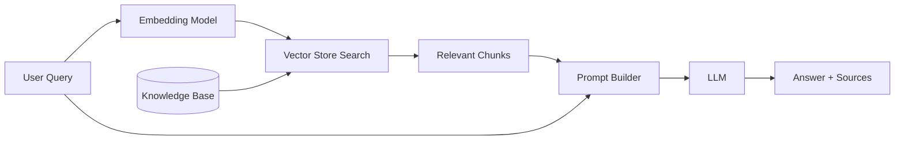

import Callout from '../../components/Callout.astro';
import Playground from '../../components/Playground.astro';

## Overview

Retrieval-Augmented Generation (RAG) is one of the most important patterns in production AI systems. Instead of relying solely on the LLM's frozen training data, RAG **retrieves relevant documents** from an external knowledge base and **injects them into the prompt** as context.

This gives the LLM access to up-to-date, domain-specific, or proprietary information without fine-tuning.

## When to Use

- Your LLM needs access to **current or private data** not in its training set
- You want to **reduce hallucinations** by grounding responses in sources
- You have a knowledge base (docs, FAQs, wikis) to make searchable
- You need **attributable** answers (cite sources)

## Architecture

## How It Works

1. **Indexing Phase** (offline): Split documents into chunks, generate embeddings, store in a vector database
2. **Query Phase** (online): Embed the user query, search for similar chunks, build a prompt with retrieved context, send to LLM

### Key Components

| Component | Purpose | Examples |
|-----------|---------|----------|
| Chunker | Split documents into retrievable pieces | RecursiveTextSplitter, sentence-based |
| Embedding Model | Convert text to dense vectors | OpenAI `text-embedding-3-small`, Cohere Embed |
| Vector Store | Fast similarity search | Pinecone, Chroma, Weaviate, pgvector |
| Reranker | Re-score results for relevance | Cohere Rerank, cross-encoders |
| Prompt Builder | Assemble context + query | Template with retrieved chunks |

## Implementation

<Playground code={`# Simplified RAG Pipeline Demo
# This shows the core concept without external dependencies

from dataclasses import dataclass
import math

@dataclass
class Document:
    content: str
    source: str

# --- 1. Simple TF-IDF-like embedding (demo only) ---
def simple_embed(text: str, vocab: list[str]) -> list[float]:
    """Toy embedding: word frequency vector."""
    words = text.lower().split()
    return [words.count(w) / max(len(words), 1) for w in vocab]

def cosine_sim(a: list[float], b: list[float]) -> float:
    dot = sum(x * y for x, y in zip(a, b))
    mag_a = math.sqrt(sum(x**2 for x in a))
    mag_b = math.sqrt(sum(x**2 for x in b))
    if mag_a == 0 or mag_b == 0:
        return 0.0
    return dot / (mag_a * mag_b)

# --- 2. Build a tiny knowledge base ---
knowledge_base = [
    Document("RAG combines retrieval with generation to ground LLM responses in external data.", "rag-overview.md"),
    Document("Vector databases store embeddings and support fast approximate nearest neighbor search.", "vector-db.md"),
    Document("Chain-of-thought prompting asks the model to show reasoning step by step.", "cot.md"),
    Document("Fine-tuning adjusts model weights on domain-specific data for better performance.", "fine-tuning.md"),
    Document("Chunking strategies include fixed-size, sentence-based, and semantic splitting.", "chunking.md"),
]

# Build vocabulary from all documents
all_words = set()
for doc in knowledge_base:
    all_words.update(doc.content.lower().split())
vocab = sorted(all_words)

# --- 3. Index: embed all documents ---
doc_embeddings = [(doc, simple_embed(doc.content, vocab)) for doc in knowledge_base]

# --- 4. Query: retrieve relevant docs ---
query = "How does RAG use vector search to find relevant information?"
query_emb = simple_embed(query, vocab)

# Rank by similarity
results = sorted(doc_embeddings, key=lambda x: cosine_sim(query_emb, x[1]), reverse=True)

print("Query:", query)
print("\\n--- Top 3 Retrieved Documents ---")
for i, (doc, emb) in enumerate(results[:3]):
    score = cosine_sim(query_emb, emb)
    print(f"\\n[{i+1}] Score: {score:.3f}")
    print(f"    Source: {doc.source}")
    print(f"    Content: {doc.content}")

# --- 5. Build prompt (would go to LLM) ---
context = "\\n".join(f"- {r[0].content}" for r in results[:3])
prompt = f"""Answer the question based on the provided context.

Context:
{context}

Question: {query}
Answer:"""

print("\\n--- Generated Prompt ---")
print(prompt)
`} />

## Gotchas & Best Practices

<Callout type="danger" title="Chunk Size Matters">
  Too small → loses context. Too large → dilutes relevance and wastes tokens. 
  Start with **256-512 tokens** with **50-100 token overlap**. Benchmark different sizes on your data.
</Callout>

<Callout type="danger" title="Embedding Query ≠ Document">
  Queries are short and question-shaped; documents are long and declarative. Consider using 
  **query expansion** or **HyDE** (Hypothetical Document Embeddings) to bridge this gap.
</Callout>

<Callout type="warning" title="Retrieval Quality is Everything">
  If retrieval fails, the LLM can't compensate. Always measure **retrieval recall@k** separately 
  from end-to-end quality. A reranker can dramatically improve precision.
</Callout>

<Callout type="tip" title="Add Metadata Filtering">
  Don't rely on embeddings alone. Combine with metadata filters (date, category, access level) 
  to improve relevance and enforce permissions.
</Callout>

<Callout type="tip" title="Include Source Attribution">
  Always include document sources in the prompt and instruct the LLM to cite them. 
  This makes answers verifiable and builds trust.
</Callout>

## Variations

- **Naive RAG** — Basic retrieve-then-generate
- **Advanced RAG** — Adds reranking, query rewriting, hybrid search
- **Modular RAG** — Composable pipeline with routing, caching, and fallback strategies
- **Graph RAG** — Uses knowledge graphs instead of (or alongside) vector search

## Further Reading

- [RAG paper (Lewis et al., 2020)](https://arxiv.org/abs/2005.11401)
- [LangChain RAG Tutorial](https://python.langchain.com/docs/tutorials/rag/)
- [LlamaIndex documentation](https://docs.llamaindex.ai/)
