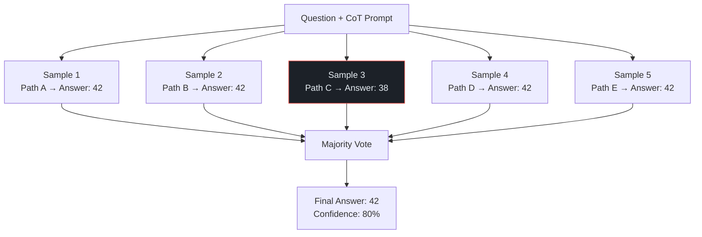

import Callout from '../../components/Callout.astro';
import Playground from '../../components/Playground.astro';

## Overview

Self-Consistency extends Chain-of-Thought by recognizing that **complex problems often have multiple valid reasoning paths** that lead to the correct answer. Instead of relying on a single greedy CoT decode, you sample multiple reasoning chains (using temperature > 0) and take a **majority vote** on the final answers.

This simple technique significantly boosts accuracy on math, logic, and commonsense reasoning tasks.

## When to Use

- Tasks where **Chain-of-Thought alone still makes errors**
- Math and logic problems with **deterministic correct answers**
- You can afford **extra inference cost** (N calls instead of 1)
- Decision-making where you want a **confidence estimate**
- Critical outputs where **reliability matters more than speed**

## Architecture

## How It Works

1. **Prompt** the LLM with a CoT prompt (zero-shot or few-shot)
2. **Sample** N responses with temperature > 0 (typically 0.5-0.8)
3. **Extract** the final answer from each response
4. **Vote** — the most common answer wins
5. **Confidence** = (count of majority answer) / N

## Implementation

<Playground code={`# Self-Consistency Pattern Implementation
from collections import Counter
import random

# === 1. Core Self-Consistency ===
def self_consistency(
    responses: list[str],
    extract_answer: callable = None
) -> dict:
    """
    Apply majority voting to multiple LLM responses.
    Returns the consensus answer and confidence.
    """
    if extract_answer is None:
        extract_answer = lambda x: x.strip().split("\\n")[-1].strip()
    
    answers = [extract_answer(r) for r in responses]
    counter = Counter(answers)
    
    majority_answer, majority_count = counter.most_common(1)[0]
    confidence = majority_count / len(answers)
    
    return {
        "answer": majority_answer,
        "confidence": confidence,
        "vote_count": majority_count,
        "total_samples": len(answers),
        "all_answers": dict(counter),
    }

# === 2. Simulate Multiple CoT Paths ===
def simulate_cot_samples(question: str, correct: str, n: int = 5, error_rate: float = 0.2) -> list[str]:
    """Simulate N chain-of-thought responses with some errors."""
    responses = []
    for i in range(n):
        if random.random() < error_rate:
            # Simulate a reasoning error
            wrong = str(int(correct) + random.choice([-3, -2, -1, 1, 2, 3])) if correct.isdigit() else "wrong"
            responses.append(f"Let me think step by step...\\n[reasoning path {i+1}]\\nThe answer is {wrong}")
        else:
            responses.append(f"Let me think step by step...\\n[reasoning path {i+1}]\\nThe answer is {correct}")
    return responses

# === 3. Extract answer from CoT response ===
def extract_final_answer(response: str) -> str:
    """Extract 'The answer is X' from a CoT response."""
    for line in reversed(response.split("\\n")):
        if "the answer is" in line.lower():
            return line.split("is")[-1].strip().rstrip(".")
    return response.strip().split("\\n")[-1].strip()

# === 4. Demo ===
random.seed(42)

problems = [
    {"question": "What is 17 × 24?", "correct": "408"},
    {"question": "A train travels 180 miles in 3 hours. What is its speed?", "correct": "60"},
    {"question": "If 3x + 7 = 22, what is x?", "correct": "5"},
]

for problem in problems:
    print(f"\\nQuestion: {problem['question']}")
    print(f"Correct answer: {problem['correct']}")
    print("-" * 45)
    
    # Single CoT (may be wrong)
    single = simulate_cot_samples(problem["question"], problem["correct"], n=1, error_rate=0.3)
    single_answer = extract_final_answer(single[0])
    print(f"Single CoT answer: {single_answer} {'✅' if single_answer == problem['correct'] else '❌'}")
    
    # Self-Consistency with 5 samples
    samples = simulate_cot_samples(problem["question"], problem["correct"], n=7, error_rate=0.3)
    result = self_consistency(samples, extract_final_answer)
    
    is_correct = result["answer"] == problem["correct"]
    print(f"Self-Consistency (N=7): {result['answer']} {'✅' if is_correct else '❌'}")
    print(f"  Confidence: {result['confidence']:.0%} ({result['vote_count']}/{result['total_samples']})")
    print(f"  Vote distribution: {result['all_answers']}")

# === 5. Confidence Calibration ===
print("\\n" + "=" * 50)
print("Confidence Calibration Demo")
print("=" * 50)

# When confidence is low, we should be less sure
test_distributions = [
    [("42", 5)],                    # Very high confidence
    [("42", 3), ("38", 2)],        # Moderate confidence
    [("42", 2), ("38", 2), ("40", 1)],  # Low confidence
]

for dist in test_distributions:
    responses = []
    for answer, count in dist:
        responses.extend([f"...The answer is {answer}"] * count)
    
    result = self_consistency(responses, extract_final_answer)
    conf_label = "HIGH" if result["confidence"] >= 0.8 else "MED" if result["confidence"] >= 0.6 else "LOW"
    print(f"  Votes: {result['all_answers']} → {result['answer']} "
          f"({result['confidence']:.0%} confidence - {conf_label})")
`} />

## Gotchas & Best Practices

<Callout type="danger" title="Cost Multiplier">
  N=5 means 5x the cost and combined latency (or 5x parallel cost). Balance accuracy gains 
  against budget. For most tasks, N=3-5 is sufficient; beyond N=10, gains diminish.
</Callout>

<Callout type="warning" title="Answer Extraction Is Tricky">
  Different reasoning paths may express the same answer differently ("60 mph", "60", "sixty"). 
  Normalize answers before voting — strip units, convert numbers, etc.
</Callout>

<Callout type="tip" title="Use Confidence as a Signal">
  Low consensus confidence (e.g., 40% on a 5-sample vote) is a reliable signal that the question 
  is hard or ambiguous. Route these to a human reviewer or a more capable model.
</Callout>

<Callout type="tip" title="Parallelize for Speed">
  Send all N requests in parallel rather than sequentially. This reduces wall-clock time 
  to approximately a single inference call while still getting the voting benefit.
</Callout>

## Variations

- **Majority Vote** — Most common answer wins
- **Weighted Vote** — Weight by model confidence/log-probability
- **Universal Self-Consistency** — For open-ended tasks where exact answer matching fails
- **Adaptive Sampling** — Stop early if consensus is already strong

## Further Reading

- [Self-Consistency (Wang et al., 2022)](https://arxiv.org/abs/2203.11171)
- [Universal Self-Consistency (Chen et al., 2023)](https://arxiv.org/abs/2311.17311)
