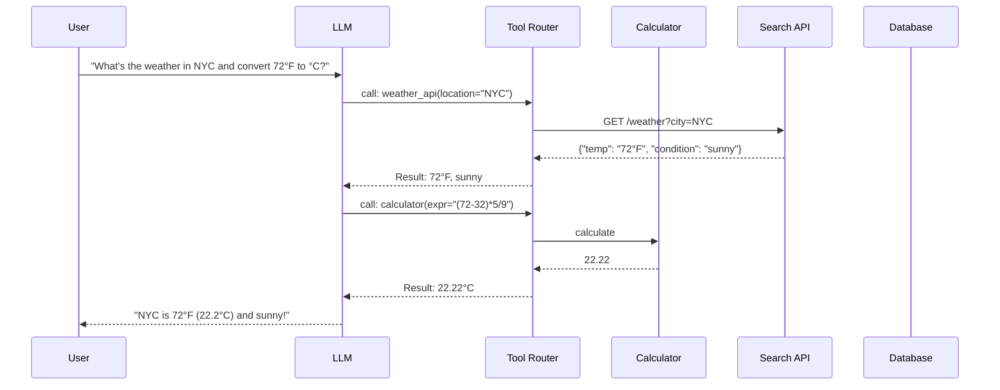

import Callout from '../../components/Callout.astro';
import Playground from '../../components/Playground.astro';

## Overview

Tool Use (also called Function Calling) lets an LLM go beyond text generation by **invoking external tools** — APIs, databases, calculators, code interpreters, or any callable function. The LLM decides *which* tool to use, *what* arguments to pass, and then incorporates the result into its response.

This pattern transforms LLMs from passive text generators into **active agents** that can interact with the world.

## When to Use

- LLM needs **real-time data** (weather, stock prices, search results)
- Tasks require **precise computation** (math, date calculations)
- You want the LLM to **take actions** (send emails, create records)
- Multi-step workflows where the LLM needs to **gather information** incrementally

## Architecture

## How It Works

1. **Define Tools**: Describe available functions with names, descriptions, and parameter schemas
2. **LLM Decides**: Given a user request, the LLM generates a structured tool call (JSON)
3. **Execute**: Your code parses the tool call and executes the actual function
4. **Return Results**: Feed the result back to the LLM for final response generation
5. **Iterate**: The LLM may chain multiple tool calls before responding

## Implementation

<Playground code={`# Tool Use Pattern - Core Implementation
import json

# --- 1. Define Tools ---
TOOLS = {
    "calculator": {
        "description": "Evaluate mathematical expressions",
        "parameters": {"expression": "string - math expression to evaluate"},
        "function": lambda expr: str(eval(expr))  # In production: use safe parser
    },
    "string_length": {
        "description": "Count the number of characters in a string",
        "parameters": {"text": "string - text to measure"},
        "function": lambda text: str(len(text))
    },
    "word_count": {
        "description": "Count words in text",
        "parameters": {"text": "string - text to count words in"},
        "function": lambda text: str(len(text.split()))
    },
    "reverse_string": {
        "description": "Reverse a string",
        "parameters": {"text": "string - text to reverse"},
        "function": lambda text: text[::-1]
    }
}

# --- 2. Build tool descriptions for the prompt ---
def format_tools_for_prompt(tools: dict) -> str:
    lines = ["Available tools:"]
    for name, info in tools.items():
        params = ", ".join(f"{k}: {v}" for k, v in info["parameters"].items())
        lines.append(f'  - {name}({params}): {info["description"]}')
    return "\\n".join(lines)

# --- 3. Parse tool calls (simplified) ---
def parse_tool_call(response: str) -> tuple[str, dict] | None:
    """Parse a tool call from LLM response. Format: TOOL_CALL: name(args)"""
    if "TOOL_CALL:" not in response:
        return None
    call_str = response.split("TOOL_CALL:")[1].strip()
    name = call_str.split("(")[0].strip()
    args_str = call_str.split("(", 1)[1].rsplit(")", 1)[0]
    return name, {"input": args_str}

# --- 4. Execute tool ---
def execute_tool(name: str, args: dict) -> str:
    if name not in TOOLS:
        return f"Error: Unknown tool '{name}'"
    try:
        result = TOOLS[name]["function"](args["input"])
        return f"Result: {result}"
    except Exception as e:
        return f"Error: {str(e)}"

# --- 5. Demo: Simulate tool use loop ---
print(format_tools_for_prompt(TOOLS))
print()

# Simulate LLM deciding to use tools
simulated_requests = [
    ("What is 245 * 18 + 73?", "TOOL_CALL: calculator(245 * 18 + 73)"),
    ("How many characters in 'Retrieval Augmented Generation'?", 
     "TOOL_CALL: string_length(Retrieval Augmented Generation)"),
    ("Reverse the word 'transformer'", 
     "TOOL_CALL: reverse_string(transformer)"),
]

for user_query, llm_response in simulated_requests:
    print(f"User: {user_query}")
    print(f"LLM decides: {llm_response}")
    
    parsed = parse_tool_call(llm_response)
    if parsed:
        name, args = parsed
        result = execute_tool(name, args)
        print(f"Tool result: {result}")
    print()

# --- 6. Tool schema (OpenAI-compatible format) ---
print("=== OpenAI-Compatible Tool Schema ===")
schema = {
    "type": "function",
    "function": {
        "name": "calculator",
        "description": "Evaluate a mathematical expression",
        "parameters": {
            "type": "object",
            "properties": {
                "expression": {
                    "type": "string",
                    "description": "The math expression to evaluate"
                }
            },
            "required": ["expression"]
        }
    }
}
print(json.dumps(schema, indent=2))
`} />

## Gotchas & Best Practices

<Callout type="danger" title="Never Trust LLM Output Directly">
  The LLM generates tool arguments as text. **Always validate and sanitize** before executing. 
  Never pass LLM output directly to `eval()`, SQL queries, or shell commands in production.
</Callout>

<Callout type="danger" title="Tool Descriptions Are Critical">
  Poorly described tools lead to wrong tool selection. Write descriptions like API docs — be precise 
  about what the tool does, what inputs it expects, and what it returns.
</Callout>

<Callout type="warning" title="Limit Tool Count">
  More tools ≠ better. With too many tools (>15-20), LLMs struggle to pick the right one. 
  Group related tools, use routing, or implement a tool-selection layer.
</Callout>

<Callout type="tip" title="Error Handling Is Essential">
  Tools fail — APIs time out, inputs are invalid. Return clear error messages to the LLM so it can 
  retry with different parameters or explain the failure to the user.
</Callout>

<Callout type="tip" title="Include Examples in Tool Descriptions">
  Adding example inputs/outputs to tool descriptions dramatically improves tool use accuracy. 
  Example: `"Calculate math expression. Example: calculator('2 + 2') → '4'"`
</Callout>

## Variations

- **Single-turn** — One tool call per request
- **Multi-turn** — LLM chains multiple tool calls iteratively
- **Parallel** — Multiple independent tool calls executed simultaneously
- **Nested** — Tool results trigger further tool calls
- **Human-in-the-loop** — Require approval for sensitive tool calls

## Further Reading

- [OpenAI Function Calling Guide](https://platform.openai.com/docs/guides/function-calling)
- [Anthropic Tool Use Docs](https://docs.anthropic.com/en/docs/build-with-claude/tool-use)
- [Gorilla LLM](https://gorilla.cs.berkeley.edu/) — Fine-tuned for tool use
