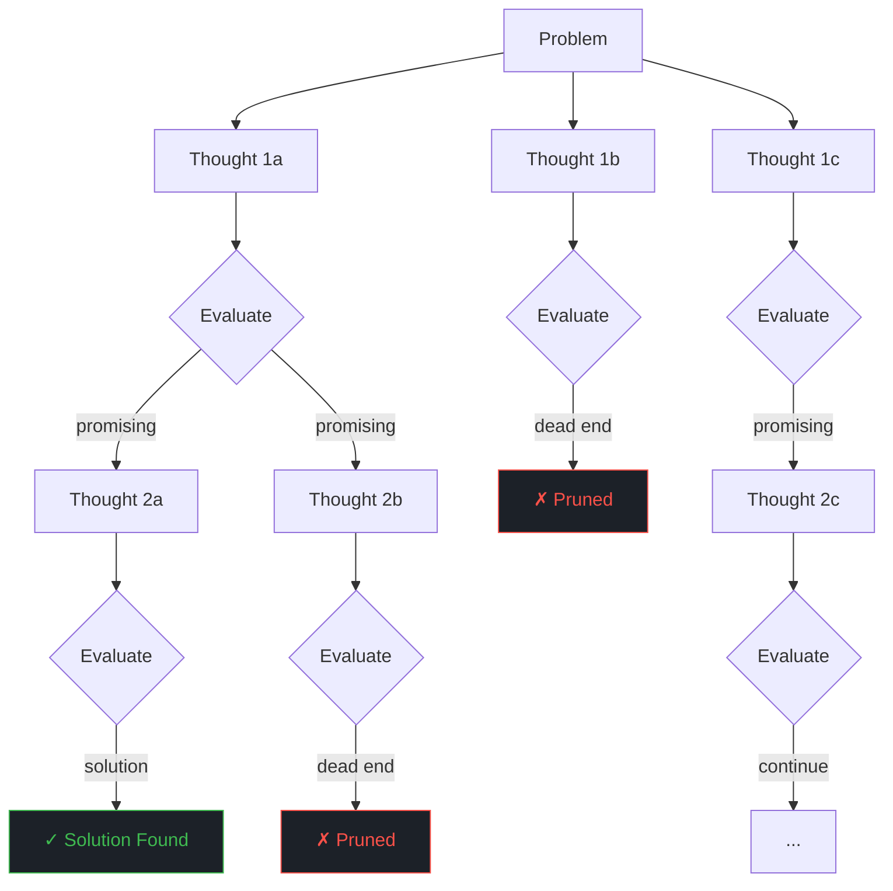

import Callout from '../../components/Callout.astro';
import Playground from '../../components/Playground.astro';

## Overview

Tree-of-Thought (ToT) extends Chain-of-Thought by exploring **multiple reasoning branches** at each step, evaluating the promise of each branch, and **backtracking** when a path leads to a dead end. While CoT is a linear chain, ToT is a tree — enabling search-like reasoning over a space of possible solutions.

## When to Use

- **Planning and puzzle** problems (e.g., Game of 24, crosswords)
- Tasks requiring **exploration and backtracking**
- Creative tasks with **multiple valid approaches** to explore
- Problems where the first attempt often fails and **revision** is needed
- Complex multi-step reasoning where **early mistakes compound**

## Architecture

## Components

| Component | Purpose | Example |
|-----------|---------|---------|
| **Thought Generator** | Propose next steps from current state | Generate 2-3 candidate next moves |
| **State Evaluator** | Rate how promising a partial solution is | "Score 1-10: how close to solution?" |
| **Search Strategy** | Decide which branches to explore | BFS (breadth-first) or DFS (depth-first) |
| **Backtracking** | Abandon unpromising paths | Prune branches below threshold |

## Implementation

<Playground code={`# Tree-of-Thought Pattern Implementation
from dataclasses import dataclass, field

@dataclass
class ThoughtNode:
    """A node in the thought tree."""
    state: str
    value: float = 0.0
    depth: int = 0
    children: list = field(default_factory=list)
    parent: object = None
    
    def __repr__(self):
        return f"Node(depth={self.depth}, value={self.value:.1f}, state='{self.state[:40]}...')" if len(self.state) > 40 else f"Node(depth={self.depth}, value={self.value:.1f}, state='{self.state}')"

class TreeOfThought:
    """Simple Tree-of-Thought with BFS search."""
    
    def __init__(self, max_depth: int = 3, branch_factor: int = 3, threshold: float = 0.3):
        self.max_depth = max_depth
        self.branch_factor = branch_factor
        self.threshold = threshold
        self.explored = 0
        self.pruned = 0
    
    def generate_thoughts(self, state: str, problem: str) -> list[str]:
        """Generate candidate next thoughts. (LLM call in production)"""
        # Simulated thought generation for demo
        return []  # Override per problem
    
    def evaluate_state(self, state: str, problem: str) -> float:
        """Evaluate how promising a state is (0-1). (LLM call in production)"""
        return 0.5  # Override per problem
    
    def solve(self, problem: str) -> list[ThoughtNode]:
        """BFS search through the thought tree."""
        root = ThoughtNode(state=problem, depth=0)
        root.value = self.evaluate_state(problem, problem)
        
        # BFS queue
        frontier = [root]
        solutions = []
        
        while frontier:
            # Sort by value (best-first search)
            frontier.sort(key=lambda n: n.value, reverse=True)
            current = frontier.pop(0)
            self.explored += 1
            
            if current.depth >= self.max_depth:
                solutions.append(current)
                continue
            
            # Generate child thoughts
            thoughts = self.generate_thoughts(current.state, problem)
            
            for thought in thoughts[:self.branch_factor]:
                child = ThoughtNode(
                    state=thought,
                    depth=current.depth + 1,
                    parent=current
                )
                child.value = self.evaluate_state(thought, problem)
                current.children.append(child)
                
                # Prune unpromising branches
                if child.value >= self.threshold:
                    frontier.append(child)
                else:
                    self.pruned += 1
        
        return sorted(solutions, key=lambda n: n.value, reverse=True)

# === Demo: Number Puzzle ===
# Problem: Use the numbers [4, 7, 8, 3] and basic operations to make 24

class NumberPuzzleToT(TreeOfThought):
    """Solve 'Game of 24' using Tree-of-Thought."""
    
    def __init__(self):
        super().__init__(max_depth=3, branch_factor=3, threshold=0.2)
        self.target = 24
    
    def generate_thoughts(self, state: str, problem: str) -> list[str]:
        """Generate candidate operations."""
        # Simplified: predefined thought paths for demo
        thought_map = {
            "Use [4, 7, 8, 3] to make 24": [
                "8 × 3 = 24, remaining: [4, 7, 24]",
                "7 + 3 = 10, remaining: [4, 8, 10]",
                "8 - 3 = 5, remaining: [4, 7, 5]",
            ],
            "8 × 3 = 24, remaining: [4, 7, 24]": [
                "24 + 4 - 7 = 21 ✗ (not 24 with leftover)",
                "24 × 4 / 7 ≈ 13.7 ✗",
                "(4 - 7) + 24 = 21 ✗",
            ],
            "7 + 3 = 10, remaining: [4, 8, 10]": [
                "10 + 8 + 4 = 22 ✗",
                "10 × 8 / 4 = 20 ✗",
                "(10 - 4) × 8 = 48 ✗",
            ],
            "8 - 3 = 5, remaining: [4, 7, 5]": [
                "5 × 7 - 4 = 31 ✗",
                "(7 - 5) × 4 = 8 ✗",
                "4 × (7 - 5) = 8 ✗",
            ],
        }
        return thought_map.get(state, ["No further moves"])
    
    def evaluate_state(self, state: str, problem: str) -> float:
        """Evaluate: closer to 24 = higher score."""
        if "= 24" in state and "✗" not in state and "remaining" not in state:
            return 1.0  # Perfect solution
        if "24" in state and "remaining" in state:
            return 0.7  # Promising - made 24 but need to use rest
        if "✗" in state:
            return 0.1  # Dead end
        if "remaining" in state:
            return 0.5  # Intermediate step
        return 0.4

# Run the solver
print("=== Tree-of-Thought: Game of 24 ===")
print("Problem: Use [4, 7, 8, 3] to make 24\\n")

solver = NumberPuzzleToT()
problem = "Use [4, 7, 8, 3] to make 24"
solutions = solver.solve(problem)

print(f"Nodes explored: {solver.explored}")
print(f"Branches pruned: {solver.pruned}")
print(f"Solutions found: {len(solutions)}\\n")

print("--- Search Tree ---")
def print_tree(node, indent=0):
    prefix = "  " * indent
    val_icon = "✓" if node.value >= 0.7 else "✗" if node.value < 0.2 else "~"
    print(f"{prefix}[{val_icon} {node.value:.1f}] {node.state}")
    for child in node.children:
        print_tree(child, indent + 1)

# Print from root
root_node = solutions[0] if solutions else None
# Reconstruct tree from a fresh solve for display
root = ThoughtNode(state=problem, value=0.4)
thoughts = solver.generate_thoughts(problem, problem)
for t in thoughts:
    child = ThoughtNode(state=t, depth=1, value=solver.evaluate_state(t, problem))
    root.children.append(child)
    sub_thoughts = solver.generate_thoughts(t, problem)
    for st in sub_thoughts[:2]:  # Show first 2
        grandchild = ThoughtNode(state=st, depth=2, value=solver.evaluate_state(st, problem))
        child.children.append(grandchild)

print_tree(root)

print("\\n--- Best Paths ---")
for i, sol in enumerate(solutions[:3]):
    print(f"  Path {i+1}: value={sol.value:.1f} → {sol.state}")
`} />

## Gotchas & Best Practices

<Callout type="danger" title="Extremely High Cost">
  ToT requires N evaluations per node × M nodes per level × D levels deep. 
  A tree with branching factor 3 and depth 3 needs up to 39 LLM calls. 
  Only use for high-value tasks that justify the cost.
</Callout>

<Callout type="warning" title="Evaluation Quality Is Critical">
  The whole approach depends on the evaluator accurately scoring partial solutions. 
  If the evaluator is unreliable, the search explores wrong branches and misses right ones.
</Callout>

<Callout type="tip" title="Start with Self-Consistency">
  For most tasks, Self-Consistency (sample N + vote) gives 80% of the benefit at much lower 
  complexity. Only upgrade to full ToT when you need backtracking and structured exploration.
</Callout>

<Callout type="tip" title="DFS for Memory, BFS for Quality">
  Depth-first search uses less memory and finds solutions faster. Breadth-first explores 
  more options and finds better solutions. Choose based on your constraint.
</Callout>

## Variations

- **BFS-ToT** — Explore breadth-first, evaluate all branches at each level
- **DFS-ToT** — Depth-first with backtracking
- **Beam Search** — Keep top-K branches at each level
- **MCTS-ToT** — Monte Carlo Tree Search for exploration/exploitation balance
- **Graph-of-Thought** — Allow merging of branches (DAG instead of tree)

## Further Reading

- [Tree of Thoughts (Yao et al., 2023)](https://arxiv.org/abs/2305.10601)
- [Graph of Thoughts (Besta et al., 2023)](https://arxiv.org/abs/2308.09687)
- [LATS - Language Agent Tree Search (Zhou et al., 2023)](https://arxiv.org/abs/2310.04406)
